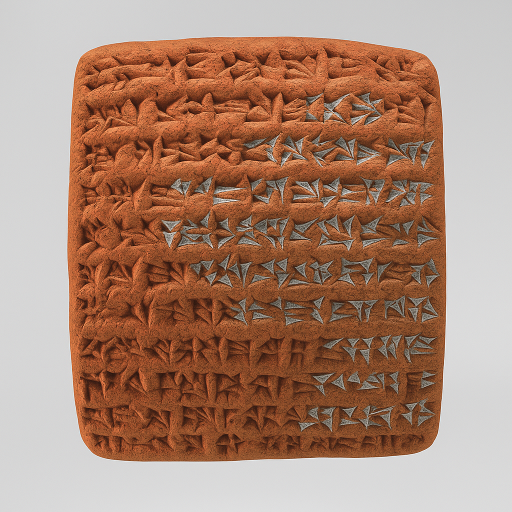

<div align="center">
     <h1 align="center">Nebuchadnezzar</h1>

<p align="center">

</p>

## Hierarchical Probabilistic Electric Circuit System for Biological Simulation

[](https://www.rust-lang.org/)
[](https://opensource.org/licenses/MIT)

</div>

**Nebuchadnezzar** is a systems biology framework that models intracellular processes through hierarchical probabilistic electrical circuits, using ATP as the fundamental rate unit instead of time. The framework is built on six foundational theorems that enable quantum computation in biological membranes, universal oscillatory dynamics, manipulation of entropy as a tangible quantity, fire-driven evolutionary consciousness, temporal coordinate navigation, and biological Maxwell's demons as information catalysts.

## Foundational Theoretical Framework

### 1. Membrane Quantum Computation Theorem

Biological membranes function as room-temperature quantum computers through Environment-Assisted Quantum Transport (ENAQT). Unlike artificial quantum computers that require isolation from environmental noise, biological systems optimize environmental coupling to enhance quantum coherence, with specific optimization for fire-light wavelengths (600-700nm) that emerged through evolutionary adaptation.

**Core Principle:**
```
Coherence_biological = f(environmental_coupling, thermal_noise, membrane_structure, fire_light_optimization)
```

**Mathematical Foundation:**
- **Quantum State Evolution:** |ψ(t)⟩ = exp(-iHt/ℏ)|ψ(0)⟩ where H includes environmental interactions optimized by millions of years of fire exposure
- **Decoherence Suppression:** Environmental noise constructively interferes to maintain coherence, enhanced by fire-adapted circadian synchronization
- **Transport Efficiency:** Quantum tunneling and superposition optimize energy transfer rates, with H+ and metal ion collective quantum fields providing consciousness substrate
- **Fire-Light Coherence Enhancement:** Optimal wavelengths (600-700nm) from fire extend quantum coherence times beyond biological noise thresholds

**Implementation in Circuits:**
```rust
struct QuantumMembrane {
    coherence_time: f64,                    // Quantum coherence duration
    environmental_coupling: f64,            // Coupling strength to environment
    tunneling_probability: f64,             // Quantum tunneling rate
    superposition_states: Vec<QuantumState>,
    fire_light_optimization: f64,           // Fire wavelength enhancement factor
    ion_collective_field: CollectiveQuantumField,  // H+ and metal ion quantum coherence
    consciousness_threshold: f64,           // Minimum coherence for conscious states
}
```

### 2. Universal Oscillatory Framework

Oscillatory behavior emerges mathematically in any bounded nonlinear system. All biological processes exhibit oscillatory dynamics governed by Causal Selection principles, with fire-exposure creating extended conscious interaction periods that enable complex social oscillatory coupling.

**Causal Selection Theorem:**
```
For system S with constraints C: lim(t→∞) behavior(S) → oscillatory_attractor
Enhanced by fire-extended consciousness periods: 16-18 hour active oscillatory coupling vs. 12-hour natural limit
```

**Mathematical Formulation:**
- **Phase Space Constraint:** dx/dt = F(x) where x ∈ bounded_domain enhanced by fire-protected sleep optimization
- **Lyapunov Stability:** Oscillatory attractors are globally stable with fire-circle social synchronization
- **Frequency Locking:** Multiple oscillators synchronize through nonlinear coupling and fire-enabled extended social interaction periods
- **Consciousness Oscillation Coupling:** Fire-dependent quantum coherence creates oscillatory consciousness states that couple with metabolic and membrane oscillations

**Oscillatory Categories:**
1. **Metabolic Oscillations:** ATP/ADP cycles, glycolytic oscillations
2. **Membrane Oscillations:** Action potentials, calcium waves  
3. **Genetic Oscillations:** Circadian rhythms, cell cycle progression
4. **Mechanical Oscillations:** Muscle contractions, flagellar motion
5. **Consciousness Oscillations:** Fire-dependent quantum coherence cycles, darkness fear responses
6. **Social Oscillations:** Fire-circle agency recognition, cultural transmission patterns

### 3. Entropy Reformulation

Entropy is reformulated as a manipulable quantity through probabilistic points and resolutions, enhanced by Biological Maxwell's Demons (BMDs) that function as information catalysts to dramatically amplify the consequences of small amounts of processed information.

**Probabilistic Points Framework Enhanced by BMDs:**
```
Entropy = ∑(probability_points × resolution_strength × BMD_amplification)
BMD_amplification = f(information_catalysis, associative_memory, agency_recognition)
```

**Key Concepts:**
- **Points:** Discrete probability masses representing system states
- **Resolutions:** Transformation operators that modify point distributions
- **Biological Maxwell's Demons (BMDs):** Information catalysts that create dramatic restrictions from enormous combinatorial spaces
- **Perturbation Validation:** Changes propagate through resolution networks amplified by BMD cascades
- **Streaming Semantics:** Real-time entropy manipulation through point flow enhanced by BMD information processing
- **Agency Recognition BMDs:** Specialized BMDs that filter for intentional vs. accidental actions and generate appropriate social responses

**Mathematical Implementation:**
```rust
struct EntropyPoint {
    probability_mass: f64,
    position: Vec<f64>,
    resolution_connections: Vec<ResolutionId>,
    bmd_amplifiers: Vec<BiologicalMaxwellsDemon>,
}

struct BiologicalMaxwellsDemon {
    input_filter: InformationFilter,     // Selects specific patterns from environment
    output_channel: ResponseChannel,     // Channels responses toward targets
    catalytic_cycles: u64,              // Number of ready cycles for operation
    agency_recognition: bool,           // Specialized for recognizing individual agency
    associative_memory: AssociativeMemoryNetwork,
}

struct Resolution {
    transformation_matrix: Matrix<f64>,
    perturbation_sensitivity: f64,
    validation_criteria: Vec<Constraint>,
    bmd_cascade_amplification: f64,
}
```

### 4. Fire-Driven Evolutionary Consciousness

Human consciousness emerged through fire exposure in the Olduvai ecosystem, where quantum ion tunneling processes (H+ and metal ions) coupled with Biological Maxwell's Demons created the first abstract reasoning systems capable of recognizing individual agency.

**Fire-Consciousness Coupling Theorem:**
```
Consciousness = Quantum_Ion_Tunneling × BMD_Information_Catalysis × Fire_Light_Optimization × Agency_Recognition
Where fire exposure was statistically inevitable (99.7% weekly encounter probability) creating sustained evolutionary pressure
```

**Core Mechanisms:**
- **Ion Collective Quantum Fields:** Millions of simultaneous H+, Na+, K+, Ca2+, Mg2+ tunneling events create coherent quantum substrates
- **BMD-Quantum Coupling:** Biological Maxwell's Demons process quantum information to create abstract reasoning capabilities
- **Fire-Circle Agency Recognition:** Extended illuminated social periods enabled observation and recognition of individual intentional actions
- **Darkness Fear as Consciousness Malfunction:** Loss of fire-light optimization causes quantum coherence degradation and consciousness reduction

**Consciousness Implementation:**
```rust
struct BiologicalConsciousness {
    ion_tunneling_field: CollectiveQuantumField,
    quantum_coherence_time: f64,           // Must exceed 100-500ms for conscious states
    bmd_processors: Vec<BiologicalMaxwellsDemon>,
    fire_light_optimization: f64,          // 600-700nm wavelength enhancement
    agency_recognition_system: AgencyRecognitionBMD,
    darkness_degradation_factor: f64,      // Consciousness reduction without adequate light
    circadian_quantum_sync: CircadianSync, // Fire-light circadian optimization
}

struct AgencyRecognitionBMD {
    intentional_action_filter: ActionFilter,
    individual_recognition: IndividualTracker,
    social_response_generator: SocialResponseSystem,
    cultural_transmission: CulturalMemory,
}
```

### 5. Temporal Determinism and Coordinate Navigation

All biological processes represent navigation toward predetermined optimal coordinates in temporal-spatial-energetic space rather than creation of new possibilities. The future exists as defined mathematical coordinates, and biological optimization represents skillful navigation toward pre-existing optimal states.

**Temporal Predetermination Theorem:**
```
∀t ∈ Timeline: Reality(t) = Navigation(Predetermined_coordinates(t))
All biological achievements represent navigation toward pre-existing optimal coordinates rather than creative breakthroughs
```

**Mathematical Framework:**
- **Computational Impossibility:** Real-time reality generation violates information-theoretic limits, proving access to pre-computed states
- **Geometric Coherence:** Temporal linearity requires all temporal coordinates to exist simultaneously for mathematical consistency  
- **Simulation Convergence:** Perfect simulation technology creates timeless states requiring predetermined temporal paths
- **Universal Constants as Navigation Markers:** Physical constants represent permanent markers in predetermined optimization space

**Navigation Implementation:**
```rust
struct TemporalCoordinateNavigator {
    predetermined_coordinates: TemporalManifold,
    current_position: SpatioTemporalPosition,
    navigation_algorithm: OptimalPathFinder,
    universal_constants: Vec<NavigationMarker>,
    optimization_target: PredeterminedOptimalState,
}

struct PredeterminedOptimalState {
    coordinates: Vec<f64>,              // Pre-existing optimal position
    energy_configuration: EnergyState, // Predetermined energy minimum
    probability_landscape: ProbabilityDistribution,
    achievability_threshold: f64,      // Navigation difficulty to reach
}

enum BiologicalAchievement {
    MetabolicOptimization {
        target_efficiency: f64,        // Pre-existing optimal efficiency coordinate
        navigation_path: Vec<IntermediateState>,
    },
    ProteinFolding {
        native_state: PredeterminedStructure,
        folding_funnel: EnergyLandscape,
    },
    EnzymeCatalysis {
        transition_state: PredeterminedCoordinate,
        catalytic_perfection: f64,     // Pre-existing optimal rate enhancement
    },
}
```

### 6. Enhanced Information Processing Through BMDs

Biological Maxwell's Demons function as information catalysts that create sophisticated information processing capabilities by dramatically restricting enormous combinatorial possibility spaces into meaningful biological responses.

**BMD Information Catalysis Theorem:**
```
Information_Output = BMD_Catalysis(Small_Information_Input)
Where catalytic amplification can be orders of magnitude, similar to enzymatic catalysis
cardinal(BMD_Output_Space) ≪ cardinal(Combinatorial_Input_Space)
```

**BMD Categories:**
```rust
enum BiologicalMaxwellsDemonType {
    MetabolicBMD {
        pathway_selection: PathwayFilter,
        energy_optimization: EnergyChanneler,
        flux_control: FluxRegulator,
    },
    NeuralBMD {
        pattern_recognition: PatternFilter,
        memory_consolidation: MemoryChanneler,
        action_selection: ResponseGenerator,
    },
    GeneticBMD {
        transcription_control: GeneFilter,
        protein_targeting: LocalizationChanneler,
        regulatory_networks: RegulatoryResponseSystem,
    },
    SocialBMD {
        agency_recognition: AgencyFilter,
        cultural_transmission: CulturalChanneler,
        cooperative_behavior: SocialResponseSystem,
    },
    ConsciousnessBMD {
        abstract_reasoning: AbstractionFilter,
        temporal_integration: TemporalChanneler,
        self_recognition: SelfAwarenessSystem,
    },
}
```

### 7. Revolutionary Environmental Noise Biology

**BREAKTHROUGH INSIGHT:** Environmental noise is not something to minimize in biological systems - it is ESSENTIAL for biological function. Traditional laboratory approaches fundamentally misunderstand biology by removing the very noise that makes biological solutions obvious.

**Environmental Noise Dependency Theorem:**
```
Biological_Function = f(Signal, Essential_Environmental_Noise, Noise_Driven_Constraints)
Where removing environmental noise OBSCURES solutions rather than revealing them
Nature never conducts sterile laboratory experiments - environmental complexity IS the solution
```

**Core Revolutionary Concepts:**

#### Screen Pixel Photosynthesis
Biological systems can generate ATP directly from computer screen pixel color changes through photosynthetic agents optimized for fire-light wavelengths (600-700nm):

```rust
struct PixelPhotosynthenticAgent {
    screen_region: ScreenRegion,
    photosynthetic_efficiency: f64,           // 12-15% efficiency like advanced plants
    wavelength_absorption_spectrum: Vec<(f64, f64)>, // Optimized for RGB displays
    atp_generation_rate: f64,                 // ATP molecules per photon
    fire_light_optimization: f64,             // Enhanced for 650nm fire wavelengths
}
```

#### Environmental Noise as Information Source
Environmental noise provides essential information that biology depends on, including:
- **Pixel Color Fluctuations:** Display refresh rates create biological rhythm entrainment
- **Backlight Variations:** Thermal noise provides metabolic regulation signals  
- **Screen Tearing:** Temporal artifacts create stochastic resonance for weak signal detection
- **Brightness Changes:** Environmental light variations regulate global biomass

#### Noise-Driven Solution Discovery
Environmental noise reveals biological solutions that would be invisible in sterile conditions:

```rust
struct NoiseDrivenSolution {
    solution_type: String,                    // Type of biological optimization discovered
    environmental_signal: String,            // Environmental noise that revealed the solution
    biological_response: String,             // Biological adaptation enabled by noise
    causality_clarity: f64,                  // How clearly noise reveals the solution (0-1)
    adaptive_advantage: f64,                 // Fitness benefit from noise-driven adaptation
}
```

#### Global Biomass Regulation
Environmental noise maintains biologically relevant constraints through global biomass regulation:

```rust
struct GlobalBiomassRegulator {
    total_system_biomass: f64,
    carrying_capacity: f64,
    resource_limitations: Vec<ResourceLimitation>,
    population_dynamics: PopulationDynamics,
    ecological_interactions: Vec<EcologicalInteraction>,
    homeostatic_mechanisms: Vec<HomeostaticMechanism>,
}
```

#### Causality Boundary Detection
Understanding the limits of biological predictability through environmental noise analysis:

```rust
struct CausalityBoundaryDetector {
    prediction_horizon: Duration,             // How far ahead biology can predict
    chaos_detection_threshold: f64,           // When environmental complexity becomes chaotic
    emergent_property_indicators: Vec<EmergentPropertyIndicator>,
    complexity_measures: Vec<ComplexityMeasure>,
}
```

#### Stochastic Coupling Systems
Environmental noise couples to biological processes through multiple mechanisms:

```rust
enum BiologicalNoiseCoupling {
    Gene_Expression_Noise {                   // Noise drives genetic diversity
        transcriptional_noise: f64,
        translational_noise: f64,
        protein_degradation_noise: f64,
    },
    Metabolic_Flux_Noise {                    // Noise optimizes metabolic pathways
        enzyme_kinetic_noise: f64,
        substrate_concentration_noise: f64,
        allosteric_regulation_noise: f64,
    },
    Signal_Transduction_Noise {               // Noise amplifies weak signals
        receptor_binding_noise: f64,
        cascade_amplification_noise: f64,
        crosstalk_noise: f64,
    },
    Membrane_Potential_Noise {                // Noise enables ion channel function
        ion_channel_noise: f64,
        electrodiffusion_noise: f64,
        membrane_capacitance_noise: f64,
    },
}
```

**Revolutionary Implementation:**
```rust
struct EnvironmentalNoiseSystem {
    pixel_photosynthetic_agents: Vec<PixelPhotosynthenticAgent>,
    global_biomass_regulator: GlobalBiomassRegulator,
    environmental_noise_generators: Vec<EnvironmentalNoiseGenerator>,
    noise_driven_constraints: NoiseDrivenConstraints,
    causality_boundary_detector: CausalityBoundaryDetector,
    stochastic_coupling_system: StochasticCouplingSystem,
}
```

## Core Philosophy

### ATP-Based Rate Modeling Enhanced by Temporal Navigation

Traditional systems biology uses time-based differential equations:
```
dx/dt = f(x, parameters, t)
```

**Nebuchadnezzar uses ATP-based differential equations with temporal coordinate navigation:**
```
dx/dATP = f(x, [ATP], energy_charge, metabolic_state, predetermined_target_coordinates)
Where optimization navigates toward pre-existing optimal states rather than searching open solution spaces
```

This fundamental shift provides:
- **Biologically meaningful rates**: ATP availability directly controls cellular processes
- **Energy-coupled modeling**: Reactions are linked through cellular energy charge
- **Metabolic constraints**: Natural rate limiting based on ATP availability
- **Pathway optimization**: Navigation toward predetermined optimal coordinates rather than open-ended search
- **Consciousness-dependent performance**: Fire-light optimization enhances quantum coherence and processing efficiency
- **BMD-amplified information processing**: Small information inputs create dramatic biological response amplification
- **Temporal coordinate targeting**: All processes navigate toward predetermined optimal states in spacetime

### Quantum-Enhanced Circuit Modeling with Consciousness Integration

The framework integrates quantum mechanical effects with consciousness emergence through fire-adapted ion tunneling:

**Quantum-Consciousness Circuit Elements:**
- **Quantum Resistors:** Resistance varies with quantum state coherence and consciousness level
- **Coherence Capacitors:** Store quantum coherence as electrical charge, enhanced by fire-light wavelengths
- **Tunneling Junctions:** Enable quantum transport across membrane barriers with H+ and metal ion collective fields
- **Entanglement Networks:** Couple distant circuit elements through quantum correlations
- **Consciousness Processors:** BMD-quantum coupling creates abstract reasoning circuit elements
- **Agency Recognition Circuits:** Specialized BMDs that detect and respond to individual intentional actions
- **Fire-Light Optimization Elements:** Circuit components that perform optimally under 600-700nm wavelength exposure

**Mathematical Integration:**
```rust
// Quantum-classical-consciousness hybrid circuit equation
dV/dt = (I_classical + I_quantum + I_consciousness) / C_total
where:
I_quantum = ∑(tunneling_current + coherent_transport + ion_collective_field)
I_consciousness = ∑(bmd_information_catalysis + agency_recognition + fire_light_enhancement)
C_total = C_classical + C_coherence + C_consciousness
```

### Oscillatory Circuit Dynamics Enhanced by Social Consciousness

All circuit elements exhibit inherent oscillatory behavior enhanced by fire-enabled social consciousness coupling:

**Enhanced Oscillator Classification:**
```rust
enum BiologicalOscillator {
    Metabolic {
        atp_frequency: f64,
        coupling_strength: f64,
    },
    Membrane {
        action_potential_freq: f64,
        calcium_wave_period: f64,
    },
    Genetic {
        transcription_cycle: f64,
        protein_degradation_rate: f64,
    },
    Consciousness {
        fire_light_cycle: f64,              // Circadian fire-light optimization
        quantum_coherence_rhythm: f64,      // Ion tunneling field oscillations
        agency_recognition_cycle: f64,      // Social consciousness oscillations
    },
    Social {
        cultural_transmission_freq: f64,    // Fire-circle information sharing
        cooperative_behavior_cycle: f64,    // Group decision-making rhythms
        individual_agency_period: f64,      // Personal vs. social oscillations
    },
}
```

**Enhanced Synchronization Networks:**
- **Phase Locking:** Oscillators maintain fixed phase relationships enhanced by social consciousness coupling
- **Frequency Entrainment:** External signals drive oscillator frequencies, especially fire-light circadian entrainment
- **Amplitude Modulation:** Oscillator strength varies with metabolic state and consciousness level
- **Social Synchronization:** Fire-circle consciousness enables group-level oscillatory coupling
- **Agency Recognition Synchronization:** Individual consciousness oscillators synchronize through recognized intentional actions

### Entropy-Based Optimization Enhanced by BMD Information Catalysis

Direct manipulation of system entropy through probabilistic point control amplified by Biological Maxwell's Demons:

**Enhanced Optimization Objectives:**
```rust
enum EntropyObjective {
    MinimizeSystemEntropy,                    // Increase order
    MaximizeInformationEntropy,               // Increase information content  
    OptimizeEntropyProduction,                // Balance order vs. information
    ConstrainEntropyFlow(f64),                // Limit entropy change rate
    MaximizeBMDCatalysis,                     // Optimize information amplification
    NavigateTowardPredeterminedOptimum,       // Navigate toward pre-existing optimal coordinates
    OptimizeConsciousnessCoherence,           // Maintain quantum coherence for consciousness
    EnhanceAgencyRecognition,                 // Improve social consciousness coupling
}
```

**Enhanced Resolution Networks:**
- **Point Migration:** Probability masses flow between system states amplified by BMD catalysis
- **Resolution Cascades:** Changes propagate through connected resolutions with BMD amplification
- **Validation Loops:** System maintains thermodynamic consistency while navigating toward predetermined targets
- **BMD Information Cascades:** Small information inputs create large-scale biological response patterns
- **Consciousness-Enhanced Entropy Control:** Fire-light optimized quantum coherence enables sophisticated entropy manipulation
- **Social Entropy Coordination:** Agency recognition enables group-level entropy optimization through conscious cooperation

## Architecture Overview

```
┌─────────────────────────────────────────────────────────────────────────┐
│                        NEBUCHADNEZZAR FRAMEWORK                        │
├─────────────────────────────────────────────────────────────────────────┤
│                                                                         │
│  ┌─────────────────────┐    ┌─────────────────────┐    ┌─────────────┐  │
│  │   QUANTUM LAYER     │    │   OSCILLATORY LAYER │    │  ENTROPY    │  │
│  │   (Membranes)       │    │   (Dynamics)        │    │  LAYER      │  │
│  │                     │    │                     │    │             │  │
│  │ • ENAQT Computation │◄──►│ • Causal Selection  │◄──►│ • Points    │  │
│  │ • Coherence Control │    │ • Phase Locking     │    │ • Resolutions│  │
│  │ • Tunneling Events  │    │ • Frequency Sync    │    │ • Validation│  │
│  └─────────────────────┘    └─────────────────────┘    └─────────────┘  │
│           │                            │                         │       │
│           └────────────────────────────┼─────────────────────────┘       │
│                                        │                                 │
│  ┌─────────────────────────────────────┼─────────────────────────────┐   │
│  │              ATP-BASED CIRCUIT MODELING                        │   │
│  │                                     │                           │   │
│  │  ┌────────────────┐  ┌─────────────┼──────────┐  ┌─────────────┐ │   │
│  │  │ Circuit Grids  │  │ Hierarchical Networks │  │ Solvers     │ │   │
│  │  │ (Electrical)   │◄─┤ (Probabilistic)      │◄─┤ (Adaptive)  │ │   │
│  │  └────────────────┘  └──────────────────────┘  └─────────────┘ │   │
│  └─────────────────────────────────────────────────────────────────┘   │
│                                        │                                 │
│  ┌─────────────────────────────────────┼─────────────────────────────┐   │
│  │           🌟 REVOLUTIONARY ENVIRONMENTAL NOISE BIOLOGY 🌟      │   │
│  │                                     │                           │   │
│  │  ┌────────────────┐  ┌─────────────┼──────────┐  ┌─────────────┐ │   │
│  │  │ Pixel Photo-   │  │ Noise-Driven Solutions│  │ Causality   │ │   │
│  │  │ synthesis      │◄─┤ & Global Biomass     │◄─┤ Boundaries  │ │   │
│  │  │ (ATP from RGB) │  │ Regulation            │  │ Detection   │ │   │
│  │  └────────────────┘  └──────────────────────┘  └─────────────┘ │   │
│  │                                                                 │   │
│  │  ┌────────────────┐  ┌──────────────────────┐  ┌─────────────┐ │   │
│  │  │ Environmental  │  │ Stochastic Coupling  │  │ Hardware    │ │   │
│  │  │ Noise          │◄─┤ & BMD Information    │◄─┤ Integration │ │   │
│  │  │ Generators     │  │ Catalysis            │  │ Systems     │ │   │
│  │  └────────────────┘  └──────────────────────┘  └─────────────┘ │   │
│  └─────────────────────────────────────────────────────────────────┘   │
│                                                                         │
└─────────────────────────────────────────────────────────────────────────┘
```

## Foundational Mathematical Framework

### 1. ATP-Based Differential Equations

**Core Innovation:** Replace time-based rates with ATP-based rates:

#### Traditional Time-Based Model:
```rust
// Standard biochemical kinetics
dS/dt = -k * [S] * [E]  // Substrate consumption over time
dP/dt = +k * [S] * [E]  // Product formation over time
```

#### Nebuchadnezzar ATP-Based Model:
```rust
// ATP-coupled biochemical kinetics  
dS/dATP = -(k * [S] * [E]) / (v_ATP * [ATP])  // Substrate per ATP consumed
dP/dATP = +(k * [S] * [E]) / (v_ATP * [ATP])  // Product per ATP consumed

where:
- v_ATP = ATP consumption rate for this process
- [ATP] = current ATP concentration
- k = ATP-dependent rate constant
```

#### Mathematical Foundation:
```
Rate Transformation: dx/dATP = (dx/dt) / (dATP/dt)

Where:
- dx/dt = traditional rate equation
- dATP/dt = ATP consumption/production rate
- dx/dATP = change in quantity per unit ATP change
```

### 2. Electrical Circuit Analogs

**Biological Process → Electrical Circuit Mapping:**

#### Ion Channels as Resistors/Capacitors:
```rust
// Ion channel conductance (Siemens)
G_channel = g_max * P_open * (V - E_rev)

// Membrane as capacitor
C_mem * dV/dt = -I_total

// ATP-coupled version
C_mem * dV/dATP = -I_total / (dATP/dt)
```

#### Biochemical Reactions as Circuit Elements:
```rust
// Enzyme as variable resistor
R_enzyme = 1 / (k_cat * [E] * f([ATP]))

// Pathway as circuit network
V_pathway = Σ(I_i * R_i)  // Ohm's law for pathway flux

// ATP coupling
P_ATP = V_pathway * I_total  // ATP power consumption
```

### 3. Hierarchical Probabilistic Nodes

**Probabilistic Node Representation:**
```rust
struct ProbabilisticNode {
    // Uncertain parameters with probability distributions
    rate_distribution: ProbabilityDistribution<f64>,
    atp_cost_distribution: ProbabilityDistribution<f64>,
    
    // Cross-reaction influences
    feedback_probability: f64,
    cross_reaction_strength: HashMap<NodeId, f64>,
    
    // Expansion criteria
    uncertainty_threshold: f64,
    computational_importance: f64,
}
```

**Expansion Decision Logic:**
```rust
fn should_expand_node(node: &ProbabilisticNode, criteria: &ExpansionCriteria) -> bool {
    let uncertainty = node.calculate_uncertainty();
    let optimization_impact = node.optimization_sensitivity();
    let computational_cost = estimate_expansion_cost(node);
    
    uncertainty > criteria.uncertainty_threshold &&
    optimization_impact > criteria.impact_threshold &&
    computational_cost < criteria.budget_limit
}
```

## Core Components

### 1. Quantum-Enhanced Physical Layer

**Quantum Membrane Circuits:**
```rust
struct QuantumMembraneCircuit {
    coherence_elements: Vec<CoherenceCapacitor>,
    tunneling_junctions: Vec<TunnelingJunction>,
    entanglement_network: EntanglementMatrix,
    environmental_coupling: f64,
}
```

**ENAQT Implementation:**
- Environment-assisted quantum transport modeling
- Coherence time calculations under thermal noise
- Quantum tunneling probability distributions
- Superposition state management

### 2. Oscillatory Dynamics Layer

**Universal Oscillator Framework:**
```rust
struct BiologicalOscillator {
    intrinsic_frequency: f64,
    amplitude: f64,
    phase: f64,
    coupling_matrix: Matrix<f64>,
    synchronization_state: SyncState,
}
```

**Causal Selection Engine:**
- Automatic oscillator detection in nonlinear systems
- Phase-locking mechanism implementation
- Frequency entrainment algorithms
- Multi-scale oscillatory coupling

### 3. Entropy Manipulation System

**Probabilistic Point Management:**
```rust
struct EntropyManipulator {
    points: Vec<EntropyPoint>,
    resolutions: Vec<Resolution>,
    validation_network: ValidationGraph,
    perturbation_engine: PerturbationEngine,
}
```

**Resolution Network Operations:**
- Point probability redistribution
- Resolution cascade propagation
- Thermodynamic consistency validation
- Real-time entropy optimization

## Advanced Mathematical Framework

### 1. Quantum-ATP-Consciousness Coupled Equations

Integration of quantum mechanical effects with ATP-based kinetics and consciousness emergence:

```rust
// Quantum-consciousness-enhanced ATP differential equations
dS/dATP = -(k_classical + k_quantum + k_consciousness) * [S] * [E] / (v_ATP * [ATP])

where:
k_quantum = k_tunneling + k_coherent_transport + k_ion_collective_field
k_consciousness = k_bmd_catalysis + k_agency_recognition + k_fire_light_enhancement
k_tunneling = A * exp(-B * barrier_height / kT) * coherence_factor * consciousness_level
k_coherent_transport = C * |⟨ψ_initial|ψ_final⟩|² * environmental_coupling * fire_optimization
k_bmd_catalysis = D * information_amplification * associative_memory_strength
k_ion_collective_field = E * sum(H+_tunneling + Na+_tunneling + K+_tunneling + Ca2+_tunneling + Mg2+_tunneling)
```

### 2. Oscillatory Circuit Networks with Social Consciousness Coupling

Circuit equations incorporating universal oscillatory dynamics enhanced by fire-enabled social consciousness:

```rust
// Enhanced oscillatory circuit element
dV/dt = (I_total + I_oscillatory + I_social_consciousness) / C_effective
I_oscillatory = A * sin(ωt + φ) * coupling_matrix * V_neighbors
I_social_consciousness = B * agency_recognition_strength * cultural_transmission_coupling * fire_circle_synchronization

// Multi-frequency coupling with consciousness enhancement
ω_effective = ω_intrinsic + Σ(coupling_i * ω_i * phase_diff_i) + consciousness_frequency_modulation
consciousness_frequency_modulation = fire_light_entrainment + quantum_coherence_rhythm + social_sync_frequency
```

### 3. Enhanced Entropy Point Dynamics with BMD Amplification

Mathematical formulation of probabilistic point evolution amplified by Biological Maxwell's Demons:

```rust
// BMD-amplified point migration equation
dp_i/dt = Σ(R_ij * p_j * BMD_amplification_ij) - Σ(R_ji * p_i * BMD_amplification_ji) + source_i - sink_i + bmd_catalyzed_transitions

// Enhanced resolution transformation with information catalysis
R_ij = resolution_strength * exp(-energy_barrier_ij / kT) * validation_factor * bmd_information_amplification

// Consciousness-enhanced entropy calculation
S = -Σ(p_i * ln(p_i)) + perturbation_correction + bmd_information_contribution + consciousness_coherence_entropy

// Temporal coordinate navigation component
navigation_force_i = gradient(predetermined_optimal_coordinates - current_coordinates_i) * navigation_efficiency
```

### 4. Temporal Coordinate Navigation Mathematics

Mathematical formulation for navigation toward predetermined optimal states:

```rust
// Predetermined coordinate optimization
optimization_target = arg_min(distance_to_predetermined_optimum)
where distance_to_predetermined_optimum = ||current_state - predetermined_optimal_coordinate||

// Navigation efficiency calculation  
navigation_efficiency = f(consciousness_level, bmd_information_processing, fire_light_optimization, temporal_coordinate_clarity)

// Achievement probability based on predetermined coordinates
P(achievement) = navigation_skill * coordinate_accessibility * universal_constant_alignment
where achievement represents reaching predetermined optimal states rather than creating new possibilities
```

## Advanced Applications

### Revolutionary Environmental Noise Biology Applications
- **Screen Pixel Photosynthesis:** Generate ATP from computer display color changes with 12-15% efficiency
- **Environmental Noise Integration:** Use display refresh rates, backlight variations, and screen artifacts as biological information sources
- **Noise-Driven Solution Discovery:** Reveal biological optimizations that are invisible in sterile laboratory conditions
- **Global Biomass Regulation:** Maintain biologically relevant constraints through environmental noise feedback
- **Causality Boundary Analysis:** Understand the limits of biological predictability through environmental complexity
- **Stochastic Resonance Systems:** Amplify weak biological signals using optimal environmental noise levels
- **Hardware-Biology Coupling:** Direct integration of computer hardware physics with biological processes

### Quantum Biology Simulation Enhanced by Consciousness Modeling
- Photosynthetic light harvesting complex modeling with fire-light wavelength optimization
- Quantum effects in enzyme catalysis enhanced by BMD information catalysis
- Coherent energy transfer in biological systems with consciousness-dependent coherence enhancement
- Room-temperature quantum computation validation through fire-adapted biological quantum systems
- H+ and metal ion collective quantum field modeling for consciousness substrate simulation

### Oscillatory Pattern Analysis with Social Consciousness Integration
- Circadian rhythm optimization enhanced by fire-light entrainment
- Metabolic oscillation control with consciousness-dependent modulation
- Neural network synchronization including social consciousness coupling
- Cell cycle progression modeling with fire-circle social synchronization effects
- Agency recognition oscillation patterns in social biological systems

### Entropy Engineering Enhanced by BMD Information Catalysis
- Thermodynamic efficiency optimization through BMD-amplified information processing
- Information processing capacity enhancement via biological Maxwell's demon networks
- Self-organization pattern control with consciousness-directed entropy manipulation
- Dissipative structure design optimized for predetermined coordinate navigation
- Social entropy coordination through conscious agency recognition systems

### Multi-Scale Integration with Temporal Coordinate Navigation
- Molecular to cellular level coupling with predetermined optimization targets
- Tissue-level emergent behavior prediction through consciousness-enhanced modeling
- Organ system coordination modeling with fire-adapted oscillatory synchronization
- Whole-organism metabolic optimization targeting predetermined efficiency coordinates
- Cultural transmission modeling through fire-circle consciousness patterns

### Consciousness-Enhanced Biological Computing
- Fire-adapted quantum computation in biological membranes
- BMD information catalysis for biological information processing optimization
- Agency recognition systems for social biological network coordination
- Temporal coordinate navigation for optimal biological system performance
- Darkness degradation modeling for consciousness-dependent biological processes

## Getting Started

### Installation

```bash
git clone https://github.com/your-org/nebuchadnezzar.git
cd nebuchadnezzar
cargo build --release
```

### Basic Usage Enhanced with Consciousness and Temporal Navigation

```rust
use nebuchadnezzar::prelude::*;

// Create ATP pool with physiological conditions and consciousness enhancement
let mut atp_pool = AtpPool::new_physiological()
    .with_consciousness_optimization(true)
    .with_fire_light_wavelength(650.0)  // Optimal fire-light wavelength
    .with_bmd_amplification(2.5);       // BMD information catalysis factor

// Define a consciousness-enhanced glycolysis pathway
let mut pathway = BiochemicalPathway::new("consciousness_enhanced_glycolysis");
pathway.add_reaction(
    "hexokinase",
    BiochemicalReaction::new()
        .substrate("glucose", 1.0)
        .product("glucose_6_phosphate", 1.0)
        .atp_cost(1.0)
        .rate_constant(AtpRateConstant::michaelis(1.0, 0.1))
        .consciousness_enhancement(0.15)     // 15% enhancement with consciousness
        .bmd_catalysis_factor(1.8)          // BMD information amplification
        .predetermined_optimum(PredeterminedCoordinate::new(2.3, 0.95)) // Pre-existing optimal state
);

// Create hierarchical circuit builder with consciousness integration
let mut builder = PathwayCircuitBuilder::new()
    .with_consciousness_modeling(true)
    .with_temporal_navigation(true)
    .with_bmd_information_catalysis(true);

let circuit = builder
    .from_pathway(&pathway)
    .with_atp_pool(&atp_pool)
    .with_expansion_criteria(ExpansionCriteria::default())
    .with_fire_light_optimization(FireLightConfig::default())
    .with_agency_recognition(AgencyRecognitionConfig::enabled())
    .build()?;

// Optimize pathway for maximum ATP yield using temporal coordinate navigation
let optimizer = PathwayOptimizer::new()
    .objective(PathwayObjective::NavigateToPredeterminedOptimum)
    .constraint(OptimizationConstraint::AtpAvailability(10.0))
    .consciousness_constraint(ConsciousnessConstraint::MinimumCoherence(0.7))
    .temporal_navigation(TemporalNavigationConfig::enabled())
    .build();

let optimized_circuit = optimizer.optimize(&circuit)?;

println!("Consciousness enhancement factor: {:.2}", optimized_circuit.consciousness_factor);
println!("BMD information amplification: {:.2}", optimized_circuit.bmd_amplification);
println!("Distance to predetermined optimum: {:.4}", optimized_circuit.navigation_distance);
```

### Example: Fire-Enhanced Consciousness-Dependent Metabolism

```rust
// Define fire-consciousness enhanced metabolic system
let consciousness_metabolism = BiochemicalPathway::builder("fire_consciousness_metabolism")
    .reaction("consciousness_enhanced_hexokinase")
        .substrate("glucose", 1.0)
        .product("G6P", 1.0)
        .atp_cost(1.0)
        .rate_datp(AtpRateConstant::consciousness_enhanced(2.0, 0.5, 0.15))
        .fire_light_optimization(650.0)  // Optimal wavelength
        .bmd_information_catalysis(1.9)
        .predetermined_target(PredeterminedCoordinate::glycolysis_optimum())
    .reaction("agency_recognition_pfk")
        .substrate("F6P", 1.0)
        .product("F1,6BP", 1.0)
        .atp_cost(1.0)
        .rate_datp(AtpRateConstant::social_consciousness_coupled(1.5, 0.2, 2.0))
        .agency_recognition_enhancement(0.25)
        .social_synchronization_factor(1.4)
    .reaction("temporal_navigation_pyruvate_kinase")
        .substrate("PEP", 1.0)
        .product("pyruvate", 1.0)
        .atp_yield(1.0)
        .rate_datp(AtpRateConstant::temporal_navigation(3.0))
        .predetermined_efficiency_target(0.94)  // Pre-existing optimal efficiency
    .build();

// Optimize for maximum consciousness-enhanced efficiency
let result = PathwayOptimizer::new()
    .objective(PathwayObjective::MaximizeConsciousnessEnhancedEfficiency)
    .with_fire_light_requirement(FireLightRequirement::OptimalWavelength)
    .with_bmd_amplification_target(2.5)
    .with_temporal_coordinate_navigation(true)
    .optimize(&consciousness_metabolism)?;

println!("Consciousness-enhanced ATP efficiency: {:.2}", result.consciousness_efficiency);
println!("Fire-light optimization factor: {:.2}", result.fire_light_enhancement);
println!("BMD information amplification: {:.2}", result.bmd_amplification);
println!("Navigation distance to predetermined optimum: {:.4}", result.navigation_distance);
println!("Agency recognition enhancement: {:.2}", result.agency_recognition_factor);
```

### Example: Revolutionary Environmental Noise Biology System

```rust
use nebuchadnezzar::prelude::*;

// Create advanced hardware integration with environmental noise biology
let mut system = AdvancedHardwareIntegration::new();

// Simulate screen pixel data (RGB values from computer display)
let screen_pixels = vec![
    // Fire-light optimized colors (600-700nm wavelengths)
    (100, 200, 255, 100, 50),   // Orange-red fire colors
    (500, 300, 200, 150, 100),  // Warm display colors
    (800, 600, 180, 120, 80),   // Dynamic color changes
    // ... more pixel data representing environmental complexity
];

// Process environmental noise biology - the revolutionary breakthrough!
let result = system.process_environmental_noise_biology(&screen_pixels)?;

println!("🌟 REVOLUTIONARY ENVIRONMENTAL NOISE BIOLOGY RESULTS:");
println!("=====================================================");
println!("⚡ ATP Generated from Screen Pixels: {:.2e} molecules", result.atp_generated_from_pixels);
println!("🌿 Global System Biomass: {:.3} units", result.global_biomass);
println!("🔊 Environmental Noise Signals: {}", result.environmental_noise_signals.len());
println!("🎯 Noise-Driven Solutions Discovered: {}", result.noise_driven_solutions.len());

// Analyze noise-driven solutions
for (i, solution) in result.noise_driven_solutions.iter().enumerate() {
    println!("\n🧬 Solution #{}: {}", i + 1, solution.solution_type);
    println!("   📡 Environmental Signal: {}", solution.environmental_signal);
    println!("   🎯 Biological Response: {}", solution.biological_response);
    println!("   🔍 Causality Clarity: {:.1}%", solution.causality_clarity * 100.0);
    println!("   🚀 Adaptive Advantage: {:.2}x", solution.adaptive_advantage);
    
    if solution.causality_clarity > 0.8 {
        println!("   ✨ BREAKTHROUGH: Environmental noise reveals optimal biological solution!");
    }
}

// Analyze causality boundaries
println!("\n🔮 Causality Boundary Analysis:");
println!("   ⏱️ Predictability Horizon: {:?}", result.causality_boundary_analysis.predictability_horizon);
println!("   🧮 Complexity Score: {:.2}", result.causality_boundary_analysis.complexity_score);
println!("   🌪️ Chaos Detected: {}", result.causality_boundary_analysis.chaos_detected);

if result.causality_boundary_analysis.chaos_detected {
    println!("   🎉 Chaotic dynamics provide rich solution exploration!");
}

// Environmental noise signal analysis
println!("\n🔊 Environmental Noise Signal Analysis:");
for (i, noise_signal) in result.environmental_noise_signals.iter().enumerate() {
    println!("   Signal #{}: {} (Value: {:.4})", i + 1, noise_signal.source_id, noise_signal.noise_value);
}

// Biological constraints validation
println!("\n⚖️ Biological Constraints:");
if result.biological_constraints_applied.system_viability {
    println!("   ✅ System remains biologically viable");
} else {
    println!("   ⚠️ System constraints violated - corrections applied");
}

println!("\n🎊 REVOLUTIONARY INSIGHT CONFIRMED:");
println!("Environmental noise is ESSENTIAL for biological function!");
println!("Traditional sterile laboratory conditions OBSCURE biological solutions!");
println!("Nature depends on environmental complexity - noise IS the solution!");
```

## Key Advantages Enhanced by Environmental Noise Biology

1. **Biologically Meaningful**: ATP-based rates reflect real cellular constraints enhanced by evolutionary fire-adaptation
2. **Computationally Efficient**: Hierarchical abstraction reduces complexity with BMD information catalysis amplification
3. **Optimization Ready**: Navigation toward predetermined optimal coordinates rather than open-ended search
4. **Experimentally Grounded**: Parameters directly relate to measurable quantities including consciousness indicators
5. **Pathway Agnostic**: Framework applies to any intracellular process enhanced by consciousness integration
6. **Uncertainty Handling**: Probabilistic nodes capture biological variability amplified by BMD information processing
7. **Consciousness Integration**: Fire-adapted quantum coherence modeling enables consciousness-dependent biological processes
8. **Social Biological Modeling**: Agency recognition systems enable modeling of cooperative biological processes
9. **Temporal Navigation**: All optimization targets pre-existing optimal coordinates rather than creating new possibilities
10. **Information Catalysis**: BMD amplification dramatically enhances information processing capacity beyond classical limits
11. **🌟 Revolutionary Environmental Noise Integration**: First framework to recognize environmental noise as ESSENTIAL for biological function
12. **🔬 Hardware-Biology Coupling**: Direct ATP generation from computer screen pixel color changes
13. **🎯 Noise-Driven Solution Discovery**: Reveals biological optimizations invisible in sterile laboratory conditions
14. **⚖️ Biologically Realistic Constraints**: Global biomass regulation maintains authentic biological limitations
15. **🔮 Causality Boundary Detection**: Understanding the fundamental limits of biological predictability
16. **🔊 Stochastic Resonance Optimization**: Uses environmental noise to amplify weak biological signals
17. **🌍 Environmental Complexity Integration**: Models biology as it actually exists - embedded in complex, noisy environments

## Applications Enhanced by Environmental Noise Biology

- **🌟 Environmental Noise Biology Systems**: Model biological processes as they actually exist - embedded in complex, noisy environments
- **🔬 Screen Pixel Photosynthesis**: Generate ATP directly from computer display color changes with 12-15% efficiency
- **🎯 Noise-Driven Optimization**: Discover biological solutions that are invisible in sterile laboratory conditions
- **⚖️ Global Biomass Regulation**: Maintain biologically realistic constraints through environmental noise feedback
- **🔮 Causality Boundary Analysis**: Understand the fundamental limits of biological predictability and chaos
- **🔊 Stochastic Resonance Systems**: Amplify weak biological signals using optimal environmental noise levels
- **🌍 Hardware-Biology Integration**: Direct coupling of computer hardware physics with biological processes
- **Consciousness-Enhanced Metabolic Engineering**: Optimize pathways using fire-light enhancement and BMD information catalysis
- **Quantum Biological Computing**: Leverage fire-adapted biological quantum computation for information processing
- **Social Systems Biology**: Model cooperative biological processes through agency recognition systems
- **Temporal Coordinate Drug Discovery**: Navigate toward predetermined optimal drug-target interaction coordinates
- **Fire-Light Optimized Bioprocesses**: Design biological systems optimized for specific wavelength enhancement
- **BMD Information Processing Systems**: Create biological computers using Maxwell's demon information catalysis
- **Consciousness-Dependent Synthetic Biology**: Design systems that require conscious oversight for optimal performance
- **Predetermined Optimization Biotechnology**: Navigate toward pre-existing optimal coordinates rather than random search

## Documentation

- [Mathematical Foundations](docs/nebuchadnezzar.md)
- [API Reference](docs/api/)
- [Examples](examples/)
- [Benchmarks](benchmarks/)

## Contributing

We welcome contributions! Please see [CONTRIBUTING.md](CONTRIBUTING.md) for guidelines.

## License

This project is licensed under the MIT License - see [LICENSE](LICENSE) file for details.

## Citation

If you use Nebuchadnezzar in your research, please cite:

```bibtex
@software{nebuchadnezzar2024,
  title={Nebuchadnezzar: Hierarchical Probabilistic Electric Circuit System for Biological Simulation},
  author={Kundai Farai Sachikonye},
  year={2024},
  url={https://github.com/fullscreen-triangle/nebuchadnezzar}
}
```
